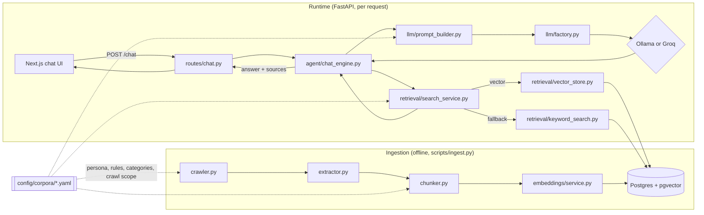

# CampusAI

> A generic, config-driven RAG (Retrieval-Augmented Generation) chatbot: point it at a sitemap or a set of seed URLs, and chat with that content. Built with a free, self-hostable stack end to end.

[](https://github.com/Dhruti832/campus-ai/actions/workflows/backend-ci.yml)
[](https://github.com/Dhruti832/campus-ai/actions/workflows/frontend-ci.yml)
[](https://github.com/Dhruti832/campus-ai/actions/workflows/e2e-ci.yml)
[](LICENSE)

**Status:** Live. **[Try the demo →](https://docuchat-psi.vercel.app)** (backend cold-starts after 15 min idle on Render's free tier — first response can take up to a minute; it's fast after that). Occasionally the very first request after a cold start fails with a gateway error — see [the memory-constraint note](#a-note-on-the-free-tier-memory-constraint) below; the frontend retries automatically, so this is usually invisible.


---

## What this is

CampusAI crawls a website (or a fixed list of pages), chunks and embeds the content, stores it in Postgres with `pgvector`, and answers natural-language questions about it using retrieval-augmented generation. The active "corpus" (what site/domain it knows about, its persona, its category rules) is entirely config-driven — swapping to a new knowledge base means pointing at a different YAML file, never editing code. The screenshot above, for example, is CampusAI pointed at FastAPI's own docs site via [`backend/config/corpora/example-docs.yaml`](backend/config/corpora/example-docs.yaml); pointing `ACTIVE_CORPUS` at [`example-university.yaml`](backend/config/corpora/example-university.yaml) instead gives you a completely different bot — different persona, different category labels, different crawl scope — with no code changes.

## Why this exists

This started as a rebuild of a university group project (a Dalhousie-specific chatbot) that had real, fixable issues: vector similarity search implemented as a brute-force Python loop over every row in a MySQL table (no index, no LIMIT), and domain-specific logic hardcoded into the orchestration layer instead of config. This version fixes both, generalizes the product, and uses a fully free tech stack. See [`docs/architecture.md`](docs/architecture.md) and [`docs/adr/`](docs/adr/) for the reasoning behind each decision.



Point `ACTIVE_CORPUS` at a different YAML file and every box above behaves differently — crawl scope, category labels, persona, chunk sizes — with zero code changes. See [`docs/architecture.md`](docs/architecture.md) for the module-by-module breakdown.

## Tech stack

| Layer | Choice |
|---|---|
| Vector DB | Postgres 16 + `pgvector` (HNSW index) — Docker locally, [Neon](https://neon.tech) free tier for the demo |
| Embeddings | `sentence-transformers` (`all-MiniLM-L6-v2`), local, free |
| LLM | [Ollama](https://ollama.com) locally, [Groq](https://groq.com) free API for the live demo |
| Backend | FastAPI |
| Frontend | Next.js + Tailwind CSS + shadcn/ui |
| Hosting | [Render](https://render.com) (backend) + [Vercel](https://vercel.com) (frontend), both free tiers |
| CI | GitHub Actions |

RAG orchestration (chunking, retrieval, prompting) is hand-rolled rather than built on LangChain/LlamaIndex — see [`docs/adr/0002-hand-rolled-vs-framework.md`](docs/adr/0002-hand-rolled-vs-framework.md) for why.

## Quickstart (local, $0)

```bash
# 1. Start Postgres+pgvector, Ollama, the backend, and the frontend
docker compose -f infra/docker-compose.yml up --build

# 2. Pull a small local model for Ollama (one-time)
docker exec -it infra-ollama-1 ollama pull phi3

# 3. Ingest a corpus (crawls, chunks, embeds, and stores it in Postgres)
python scripts/ingest.py --corpus example-docs

# 4. Open the chat UI
# http://localhost:3000
```

Prefer running the backend outside Docker for faster iteration? `cd backend && pip install -r requirements-dev.txt && uvicorn app.main:app --reload` (point `DATABASE_URL` at `docker compose up postgres` and set `ACTIVE_CORPUS`). Same idea for the frontend: `cd frontend && npm install && npm run dev`.

## Chat UI

Replies stream in token-by-token rather than appearing all at once — `POST /chat/stream` returns newline-delimited JSON (`{"type": "token", "text": ...}` chunks, then a final `{"type": "sources", ...}`) which the frontend reads incrementally via `fetch` + `ReadableStream`. A hand-rolled NDJSON-over-POST protocol rather than `text/event-stream`, since native `EventSource` can't send a POST body (see `Provider.stream()` in `llm/base.py` and `stream_reply_events()` in `agent/chat_engine.py`). The plain, non-streaming `POST /chat` endpoint still exists too.

Beyond ask-a-question-get-an-answer-with-citations, the frontend keeps a full history: every conversation is saved (client-side, `localStorage`) and listed in a sidebar, titled from its first message — click one to switch back to it, or start a new one. Replies can be pinned for quick recall, thumbs up/down on any answer records a rating against the active corpus (`POST /feedback`, aggregated in the admin panel), and the message box takes voice input via the browser's native Web Speech API (feature-detected — the mic button simply doesn't appear on browsers without support, no extra dependency). Dark mode follows the OS by default and can be toggled.

## Admin panel

Visit `/admin` on the frontend for a small operator UI: per-corpus source/chunk counts and feedback tallies, switching which corpus `/chat` serves (persisted in Postgres, takes effect immediately — no redeploy), and triggering a re-ingest by hand. It's gated by an `ADMIN_API_KEY` env var on the backend (unset = every `/admin/*` route 403s).

A corpus can also be created entirely at runtime — paste a website URL, and it's crawled and ingested with no git commit or redeploy. Since Render's filesystem is read-only after deploy, these live in a Postgres table (`corpus_configs`) rather than the YAML files the built-in example corpora use; `app/corpus_store.py` resolves either transparently. Admin-created corpora can also be edited (URL, persona, max pages) or deleted after the fact — built-in YAML corpora are read-only from this UI on purpose.

Re-ingestion can also run on a schedule via `SCHEDULED_INGEST_ENABLED=true` + `SCHEDULED_INGEST_INTERVAL_HOURS` (APScheduler, in-process). That's the right tool for an always-on deployment (Docker Compose, a paid host) — but Render's free tier sleeps the process after ~15 min idle and only wakes it on the next request, so an in-process schedule alone won't guarantee periodic runs there. For a sleeping free-tier instance, trigger `POST /admin/ingest` from an external cron (a scheduled GitHub Actions workflow, for example) instead.

## A note on the free-tier memory constraint

Render's free web service gives 512MB of RAM. `sentence-transformers` — really, the PyTorch runtime underneath it — cost roughly 375MB just to import, before a model or a request was involved. Combined with FastAPI/SQLAlchemy/everything else, a cold embedding-model load sat right at the edge of the limit, and occasionally tipped over: the process got OOM-killed and Render restarted it, which the caller saw as a `502`.

This went through three real steps, the last of which fixed it properly rather than working around it:

- **Fixed**: a genuine thread-safety bug where concurrent `/chat` requests arriving while the model was still loading could each construct their own `SentenceTransformer` instance, multiplying peak memory at the worst possible moment. A lock made this load-once-only, verified with a 10-concurrent-thread test.
- **Ruled out**: switching `sentence-transformers` to its ONNX Runtime backend, on the theory that a leaner inference engine would use less memory. Measured directly before deploying it — `sentence_transformers/SentenceTransformer.py` imports `torch` unconditionally regardless of backend choice, so the ONNX path loaded onnxruntime *in addition to* torch: peak memory measured 553MB (ONNX) vs 463MB (plain torch) for the same encode call. Worse, not better — not shipped.
- **Shipped**: dropped `sentence-transformers`/torch entirely. `app/embeddings/service.py` is now a hand-rolled `tokenizers` → `onnxruntime` forward pass → mean-pool → L2-normalize pipeline — the same three steps sentence-transformers itself runs internally, just without torch in the process. Verified mathematically identical output first (cosine similarity **1.000000** against sentence-transformers for the same `all-MiniLM-L6-v2` weights, several test sentences), then measured the real effect on the actual production code path: peak RSS for one embed call dropped from **438MB to 220MB** — a **50% cut**, and comfortably clear of the 512MB ceiling instead of skirting it. The Docker image also shrank from 2.4GB to **1.06GB** with torch gone. The model + tokenizer files (~90MB) are baked into the image at build time (see `Dockerfile`) so a cold start never pays a Hugging Face download; running outside Docker falls back to downloading them once into `backend/models/` on first use.

The frontend (`lib/api.ts`) still retries a `502`/`503`/`504` automatically (two retries, 5s then 15s backoff) as a second line of defense — cold starts can still take a few seconds for Postgres/Groq/Ollama to warm up, just no longer for the embedding model to fit in memory.

## Project structure

```
campus-ai/
├── backend/
│   ├── app/
│   │   ├── config.py          # Settings (env) + CorpusConfig (per-institution YAML)
│   │   ├── db/                # SQLAlchemy models + session factory
│   │   ├── ingestion/         # crawler, extractor, chunker, ingest_service
│   │   ├── embeddings/        # lazy-loaded sentence-transformers wrapper
│   │   ├── retrieval/         # pgvector search, Postgres FTS, orchestration
│   │   ├── llm/                # Provider protocol + Ollama/Groq + prompt builder
│   │   ├── agent/              # chat_engine.py — retrieve/prompt/generate/fallback
│   │   ├── admin_service.py    # corpus stats, active-corpus switching (DB-backed)
│   │   ├── scheduler.py        # optional in-process scheduled re-crawl (APScheduler)
│   │   └── routes/             # FastAPI /chat, /health, /admin/*
│   ├── config/corpora/         # per-institution YAML — DATA, not code
│   └── tests/{unit,integration}/
├── frontend/                   # Next.js chat UI + /admin panel (App Router, TypeScript, Tailwind)
├── e2e/                         # Playwright end-to-end tests (real frontend + backend + Postgres)
├── extension/                  # Minimal Chrome extension popup (iframes the live frontend)
├── infra/                      # docker-compose + pgvector init SQL
├── docs/                       # architecture.md, ADRs, screenshots
└── scripts/ingest.py           # CLI: crawl -> chunk -> embed -> store one corpus
```

## Browser extension

A minimal Chrome extension lives in [`extension/`](extension/) — click the toolbar icon, get the live chat UI in a popup (just an `<iframe>` onto the deployed frontend, no new backend work). Not published to the Chrome Web Store; see [`extension/README.md`](extension/README.md) for loading it unpacked.

## What I fixed vs. a naive RAG implementation

The original project (private, university course work) worked, but had three real issues this rebuild fixes:

1. **Vector search anti-pattern.** Embeddings were stored as JSON text in a MySQL `TEXT` column. Every query fetched *every* chunk's embedding out of the database (no `LIMIT`, no vector index) and computed cosine similarity in a Python `for` loop. This version uses Postgres + `pgvector` with a real HNSW index: `ORDER BY embedding <=> :query LIMIT :k` — a single indexed query, proven in [`tests/integration/test_vector_store.py`](backend/tests/integration/test_vector_store.py) against a real database.
2. **Domain hardcoding.** Institution-specific logic (navigation data, keyword sets, URL category rules, the system prompt itself) was written directly into the orchestration code. Here it all lives in [`backend/config/corpora/*.yaml`](backend/config/corpora/) — swapping institutions is a config change, never a code change.
3. **Repo hygiene.** Stray log/coverage files were committed at the repo root and `pytest` broke when run from the root. This repo has had a correct `.gitignore` and `testpaths` since commit #1, enforced by a 90% coverage gate on both backend and frontend from day one.

**Real-database benchmark**, measured against the live Neon instance (185 chunks across both example corpora): with `EXPLAIN ANALYZE`, Postgres's own planner chooses a sequential scan over the HNSW index at this size — correctly, since a seq scan is genuinely cheaper than an index scan at a few hundred rows, a well-known pgvector characteristic, not a bug. Forcing the index (`SET enable_seqscan = off`) confirms it's real and working: `Index Scan using chunks_embedding_hnsw_idx`, **0.24ms execution time**. The actual fix here was never "always use the index at any N" — it's that this is a single indexed `ORDER BY ... LIMIT` query the planner *can* route through the index as the corpus grows, where the original's Python loop fetched every row unconditionally and could never use an index at any scale.

## Retrieval quality eval

Fast retrieval is only half the story — is it retrieving the *right* chunks? [`scripts/eval_retrieval.py`](scripts/eval_retrieval.py) runs a hand-labeled query set ([`backend/eval/example-docs.yaml`](backend/eval/example-docs.yaml): 8 queries, each with the source page(s) that should come back) through the exact `search()` code `/chat` uses, and reports precision@k, recall@k, hit rate, and MRR:

```bash
python scripts/eval_retrieval.py --corpus example-docs
```

Measured against the live-ingested `example-docs` corpus: **100% hit rate**, **MRR 0.72**, **recall@5 1.00** — every query's relevant page appears in the top 5, usually ranked 1st or 2nd. This exists as much as a regression check as a one-off number: run it before and after a retrieval-affecting change (a new embedding model, a chunking tweak) to prove quality didn't quietly regress, rather than eyeballing a few example queries.

## End-to-end tests

[`e2e/`](e2e/) runs Playwright against the real frontend, backend, and a real Postgres database — the chat flow (ask a question, see a streamed reply with sources, pin, thumbs up/down) and the admin panel (auth, creating/editing/deleting a corpus). Only the LLM call itself is faked (`LLM_PROVIDER=echo`, a deterministic no-network provider) — retrieval runs for real against a couple of fixture chunks ([`scripts/seed_e2e_fixture.py`](scripts/seed_e2e_fixture.py)), avoiding the cost and flakiness of a live model call or crawl in CI. Wired into its own [`e2e-ci.yml`](.github/workflows/e2e-ci.yml) workflow; see [`e2e/README.md`](e2e/README.md) to run it locally.

## License

[MIT](LICENSE)
