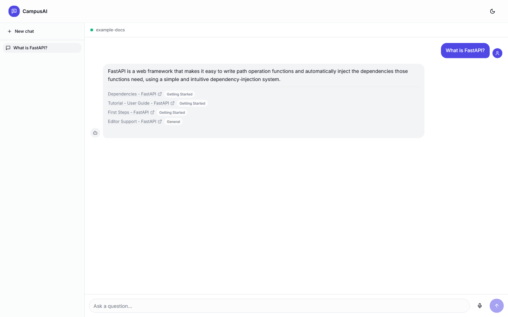

# DocuChat

> A generic, config-driven RAG (Retrieval-Augmented Generation) chatbot: point it at a sitemap or a set of seed URLs, and chat with that content. Built with a free, self-hostable stack end to end.

[](https://github.com/Dhruti832/docuchat/actions/workflows/backend-ci.yml)
[](https://github.com/Dhruti832/docuchat/actions/workflows/frontend-ci.yml)
[](LICENSE)

**Status:** Backend + frontend MVP complete and verified end to end locally (real crawl → chunk → embed → pgvector retrieval → LLM → chat UI, all tested). Not yet deployed publicly — live demo link lands here once it's on Render/Vercel/Neon.



---

## What this is

DocuChat crawls a website (or a fixed list of pages), chunks and embeds the content, stores it in Postgres with `pgvector`, and answers natural-language questions about it using retrieval-augmented generation. The active "corpus" (what site/domain it knows about, its persona, its category rules) is entirely config-driven — swapping to a new knowledge base means pointing at a different YAML file, never editing code. The screenshot above, for example, is DocuChat pointed at FastAPI's own docs site via [`backend/config/corpora/example-docs.yaml`](backend/config/corpora/example-docs.yaml); pointing `ACTIVE_CORPUS` at [`example-university.yaml`](backend/config/corpora/example-university.yaml) instead gives you a completely different bot — different persona, different category labels, different crawl scope — with no code changes.

## Why this exists

This started as a rebuild of a university group project (a Dalhousie-specific chatbot) that had real, fixable issues: vector similarity search implemented as a brute-force Python loop over every row in a MySQL table (no index, no LIMIT), and domain-specific logic hardcoded into the orchestration layer instead of config. This version fixes both, generalizes the product, and uses a fully free tech stack. See [`docs/architecture.md`](docs/architecture.md) and [`docs/adr/`](docs/adr/) for the reasoning behind each decision.

## Tech stack

| Layer | Choice |
|---|---|
| Vector DB | Postgres 16 + `pgvector` (HNSW index) — Docker locally, [Neon](https://neon.tech) free tier for the demo |
| Embeddings | `sentence-transformers` (`all-MiniLM-L6-v2`), local, free |
| LLM | [Ollama](https://ollama.com) locally, [Groq](https://groq.com) free API for the live demo |
| Backend | FastAPI |
| Frontend | Next.js + Tailwind CSS + shadcn/ui |
| Hosting | [Render](https://render.com) (backend) + [Vercel](https://vercel.com) (frontend), both free tiers |
| CI | GitHub Actions |

RAG orchestration (chunking, retrieval, prompting) is hand-rolled rather than built on LangChain/LlamaIndex — see [`docs/adr/0002-hand-rolled-vs-framework.md`](docs/adr/0002-hand-rolled-vs-framework.md) for why.

## Quickstart (local, $0)

```bash
# 1. Start Postgres+pgvector, Ollama, the backend, and the frontend
docker compose -f infra/docker-compose.yml up --build

# 2. Pull a small local model for Ollama (one-time)
docker exec -it infra-ollama-1 ollama pull phi3

# 3. Ingest a corpus (crawls, chunks, embeds, and stores it in Postgres)
python scripts/ingest.py --corpus example-docs

# 4. Open the chat UI
# http://localhost:3000
```

Prefer running the backend outside Docker for faster iteration? `cd backend && pip install -r requirements-dev.txt && uvicorn app.main:app --reload` (point `DATABASE_URL` at `docker compose up postgres` and set `ACTIVE_CORPUS`). Same idea for the frontend: `cd frontend && npm install && npm run dev`.

## Project structure

```
docuchat/
├── backend/
│   ├── app/
│   │   ├── config.py          # Settings (env) + CorpusConfig (per-institution YAML)
│   │   ├── db/                # SQLAlchemy models + session factory
│   │   ├── ingestion/         # crawler, extractor, chunker, ingest_service
│   │   ├── embeddings/        # lazy-loaded sentence-transformers wrapper
│   │   ├── retrieval/         # pgvector search, Postgres FTS, orchestration
│   │   ├── llm/                # Provider protocol + Ollama/Groq + prompt builder
│   │   ├── agent/              # chat_engine.py — retrieve/prompt/generate/fallback
│   │   └── routes/             # FastAPI /chat, /health
│   ├── config/corpora/         # per-institution YAML — DATA, not code
│   └── tests/{unit,integration}/
├── frontend/                   # Next.js chat UI (App Router, TypeScript, Tailwind)
├── infra/                      # docker-compose + pgvector init SQL
├── docs/                       # architecture.md, ADRs, screenshots
└── scripts/ingest.py           # CLI: crawl -> chunk -> embed -> store one corpus
```

## What I fixed vs. a naive RAG implementation

The original project (private, university course work) worked, but had three real issues this rebuild fixes:

1. **Vector search anti-pattern.** Embeddings were stored as JSON text in a MySQL `TEXT` column. Every query fetched *every* chunk's embedding out of the database (no `LIMIT`, no vector index) and computed cosine similarity in a Python `for` loop. This version uses Postgres + `pgvector` with a real HNSW index: `ORDER BY embedding <=> :query LIMIT :k` — a single indexed query, proven in [`tests/integration/test_vector_store.py`](backend/tests/integration/test_vector_store.py) against a real database.
2. **Domain hardcoding.** Institution-specific logic (navigation data, keyword sets, URL category rules, the system prompt itself) was written directly into the orchestration code. Here it all lives in [`backend/config/corpora/*.yaml`](backend/config/corpora/) — swapping institutions is a config change, never a code change.
3. **Repo hygiene.** Stray log/coverage files were committed at the repo root and `pytest` broke when run from the root. This repo has had a correct `.gitignore` and `testpaths` since commit #1, enforced by a 90% coverage gate on both backend and frontend from day one.

A real-database benchmark note (chunk count, query latency) will land here once the corpus grows past a trivial size in the deployed demo.

## License

[MIT](LICENSE)
