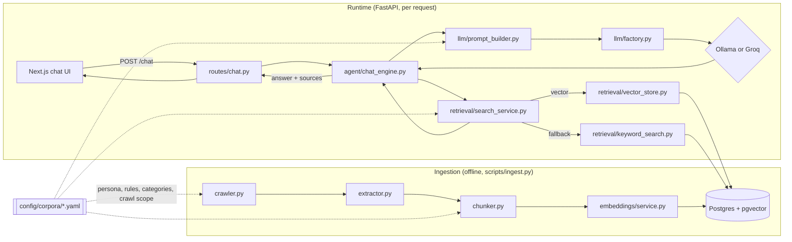

# Architecture

## Request flow

Two runs of this diagram, one per corpus config, are the whole "generic, not
institution-specific" story: point `ACTIVE_CORPUS` at a different YAML file
and every box above behaves differently — crawl scope, category labels,
persona, chunk sizes — with zero code changes.

## Per-module responsibility

| Module | Responsibility |
|---|---|
| `ingestion/crawler.py` | Depth- and page-count-bounded BFS crawl (sitemap or seed-URL mode), regex allow/deny scoping — all from `CrawlConfig`. |
| `ingestion/extractor.py` | Pulls title/headings/body text/links out of raw HTML, and text out of PDF bytes. No network. |
| `ingestion/chunker.py` | Fixed-size, word-count-bounded chunking with configurable overlap. |
| `ingestion/ingest_service.py` | Glues the above together for one corpus: crawl → chunk → embed → idempotent upsert into Postgres. |
| `embeddings/service.py` | Lazy-loaded, hand-rolled `tokenizers` + `onnxruntime` pipeline for `all-MiniLM-L6-v2` (no torch/sentence-transformers) — tokenize → ONNX forward pass → mean-pool → L2-normalize. See the free-tier memory constraint note in README.md for why. |
| `retrieval/vector_store.py` | `ORDER BY embedding <=> :q LIMIT :k` via pgvector's HNSW index — the direct fix for the original project's brute-force Python cosine loop over every row. |
| `retrieval/keyword_search.py` | Postgres full-text search (GIN-indexed `tsvector`/`ts_rank`) fallback. |
| `retrieval/search_service.py` | Orchestrates: try vector search, fall back to keyword search on empty results or failure. |
| `llm/base.py` + `ollama_provider.py` + `groq_provider.py` + `echo_provider.py` + `factory.py` | `Provider` protocol (Strategy pattern) so `LLM_PROVIDER=ollama\|groq\|echo` swaps backends with no code change. Each provider implements both `generate()` (full completion) and `stream()` (yields text chunks as they arrive). `echo_provider.py` is a deterministic, no-network provider used only by the Playwright E2E suite in CI. |
| `llm/prompt_builder.py` | Assembles the prompt from the corpus's persona/rules — never a hardcoded system prompt. Also folds in the last few conversation turns (`HistoryTurn`, capped at `MAX_HISTORY_TURNS`) so follow-up questions like "what about X" resolve correctly; retrieval itself still runs on the raw current query only. |
| `agent/chat_engine.py` | Checks the corpus's `navigation_shortcuts` first (a fixed step-by-step answer, no retrieval or LLM call), then retrieve → build context → build prompt → generate, with a fallback to the top retrieved chunk excerpt if the LLM call fails. `prepare_reply_context()`/`stream_reply_events()` split the same flow into a DB-touching half and a DB-free, streaming-safe half — see the streaming note under `routes/chat.py`. |
| `routes/chat.py` | `POST /chat` (full JSON reply) and `POST /chat/stream` (newline-delimited JSON, token-by-token), both per-IP rate limited (`slowapi`) so the shared Groq quota on the live demo can't be exhausted by one client. The streaming route runs all DB access (`prepare_reply_context`) *before* returning the `StreamingResponse`, since FastAPI closes yield-based dependencies like the DB session once the route function returns — before a streaming body is ever consumed. Also hosts `GET /active-corpus` (public — a corpus *name* isn't sensitive, unlike admin routes) and `POST /feedback` (thumbs up/down, corpus resolved server-side rather than trusted from the client). |
| `corpus_store.py` | Corpora created at runtime via the admin panel's "Add website" flow, stored as a JSONB row (`corpus_configs` table) rather than a YAML file — Render's filesystem is read-only after deploy, so this is how a new corpus gets created without a git commit + redeploy. `load_any_corpus_config()` resolves a name from the DB first, falling back to the built-in YAML files transparently. |
| `admin_service.py` + `routes/admin.py` | Authenticated (`X-Admin-Key`) corpus stats (including feedback tallies), active-corpus switching (a DB row, not an env var — survives Render's free-tier restarts), manual re-ingest, and creating/editing/deleting admin-created corpora (built-in YAML corpora are read-only from these routes). |
| `scheduler.py` | Optional in-process scheduled re-crawl (APScheduler), off by default. Right tool for an always-on deployment; on Render's free tier, prefer an external cron hitting `/admin/ingest` since the process sleeps after ~15 min idle. |

See [`docs/adr/`](adr/) for the reasoning behind each technology choice.
