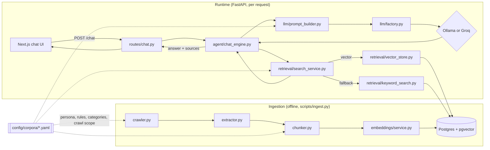

# Architecture

## Request flow

Two runs of this diagram, one per corpus config, are the whole "generic, not
institution-specific" story: point `ACTIVE_CORPUS` at a different YAML file
and every box above behaves differently — crawl scope, category labels,
persona, chunk sizes — with zero code changes.

## Per-module responsibility

| Module | Responsibility |
|---|---|
| `ingestion/crawler.py` | Depth- and page-count-bounded BFS crawl (sitemap or seed-URL mode), regex allow/deny scoping — all from `CrawlConfig`. |
| `ingestion/extractor.py` | Pulls title/headings/body text/links out of raw HTML, and text out of PDF bytes. No network. |
| `ingestion/chunker.py` | Fixed-size, word-count-bounded chunking with configurable overlap. |
| `ingestion/ingest_service.py` | Glues the above together for one corpus: crawl → chunk → embed → idempotent upsert into Postgres. |
| `embeddings/service.py` | Lazy-loaded `sentence-transformers` wrapper (`all-MiniLM-L6-v2` by default). |
| `retrieval/vector_store.py` | `ORDER BY embedding <=> :q LIMIT :k` via pgvector's HNSW index — the direct fix for the original project's brute-force Python cosine loop over every row. |
| `retrieval/keyword_search.py` | Postgres full-text search (GIN-indexed `tsvector`/`ts_rank`) fallback. |
| `retrieval/search_service.py` | Orchestrates: try vector search, fall back to keyword search on empty results or failure. |
| `llm/base.py` + `ollama_provider.py` + `groq_provider.py` + `factory.py` | `Provider` protocol (Strategy pattern) so `LLM_PROVIDER=ollama\|groq` swaps backends with no code change. |
| `llm/prompt_builder.py` | Assembles the prompt from the corpus's persona/rules — never a hardcoded system prompt. |
| `agent/chat_engine.py` | Retrieve → build context → build prompt → generate, with a fallback to the top retrieved chunk excerpt if the LLM call fails. |
| `routes/chat.py` | `POST /chat`, per-IP rate limited (`slowapi`) so the shared Groq quota on the live demo can't be exhausted by one client. |

See [`docs/adr/`](adr/) for the reasoning behind each technology choice.
